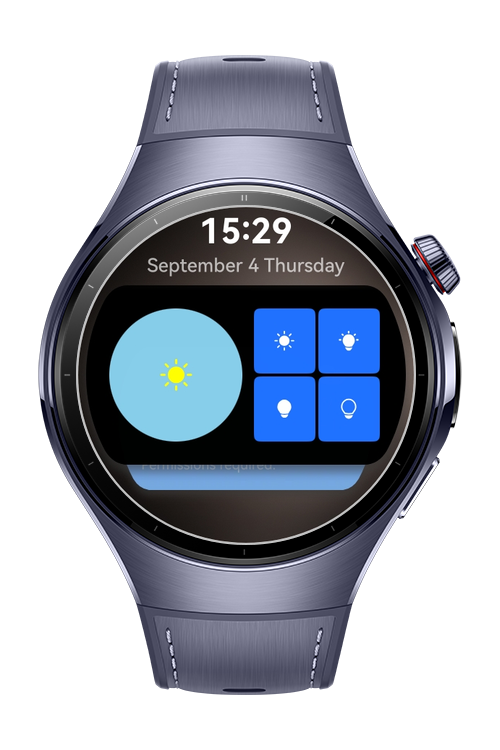
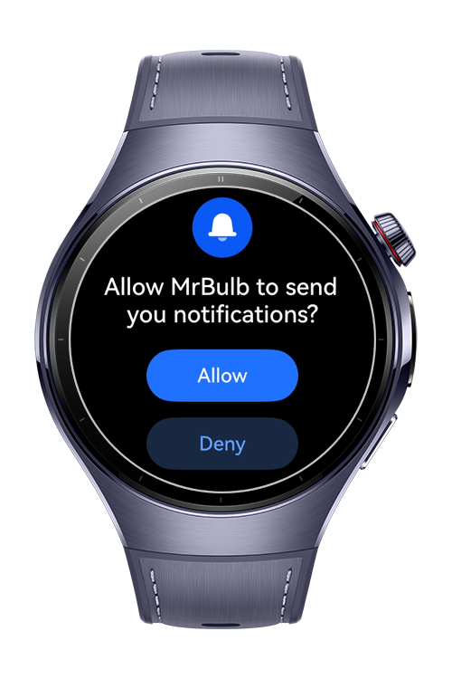

> **Note:** To access all shared projects, get information about environment setup, and view other guides, please visit [Explore-In-HMOS-Wearable Index](https://github.com/Explore-In-HMOS-Wearable/hmos-index).

# MrBulb

This app demonstrates how to control a smart light with a smart watch.

# Preview

<div>
  
  
  
  
</div>

# Use Cases

- Use slider to set RGB.
- Use 2*3 widget. (Shown in the Cards page of the watch)
- Real time data transfer between app and the widget.
- Use Gyroscope to detect wrist movements to open/close light.
- Use Agent-powered reminders to send timed notifications.

# Technology

## Stack

- **Languages**: ArkTS, ArkUI
- **Frameworks**: HarmonyOS SDK 5.1.0(18)
- **Tools**: DevEco Studio Version 5.1.1.823
- **Libraries**:
    - `@kit.ArkUI`
    - `@kit.ArkData`
    - `@kit.FormKit`
    - `@kit.BackgroundTasksKit`
    - `@kit.SensorServiceKit`
    - `@kit.NotificationKit`
    
## Required Permissions
- `ohos.permission.VIBRATE`
  > To add vibration feedback
- `ohos.permission.KEEP_BACKGROUND_RUNNING`
  > To transfer data between app and the widget
- `ohos.permission.GYROSCOPE`
  > To detect wrist movement
- `ohos.permission.PUBLISH_AGENT_REMINDER`
  > To send notification

# Directory Structure

```
entry/src/main/ets/
├───components
│       ColorController.ets
│       OpenClose.ets
│       Reminders.ets
├───entryability
│       EntryAbility.ets
├───entrybackupability
│       EntryBackupAbility.ets
├───entryformability
│       EntryFormAbility.ets
├───pages
│       Index.ets
├───util
│       Pref.ets
├───viewmodel
│       Bulb.ets
└───wearable_card
    └───pages
            Wearable_cardCard.ets
```

# Constraints and Restrictions

## Supported Device

* Huawei Watch 5

# License

**MrBulb** is distributed under the terms of the MIT License
See the [LICENSE](./LICENSE) for more information.